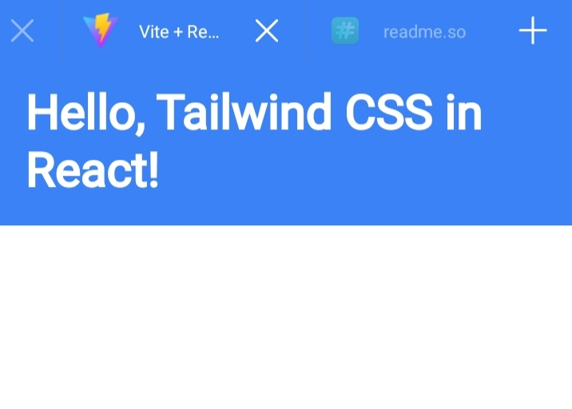

# Adding Tailwind CSS to a React.js Project

## Step 1: Install Tailwind CSS

In the root of your React project, open the terminal and run the following command to install **Tailwind CSS** and its necessary dependencies:

```bash
npm install -D tailwindcss postcss autoprefixer
```
OR 
```bash
pnpm install -D tailwindcss postcss autoprefixer
```
Once the installation is done, initialize **Tailwind CSS** with the following command:

```bash
npx tailwindcss init
```

This will create a `tailwind.config.js` file in your project.

---

## Step 2: Configure Tailwind

Open the newly created `tailwind.config.js` file and configure the `content` array to include all your template files inside the `src` folder:

```js
/** @type {import('tailwindcss').Config} */
module.exports = {
  content: [
    './src/**/*.{js,jsx,ts,tsx}', // This includes all files in the src folder
  ],
  theme: {
    extend: {},
  },
  plugins: [],
}
```

---

## Step 3: Add Tailwind Directives to CSS

In your project's CSS file (for example, `src/index.css`), add the following **@tailwind** directives to include Tailwind’s base, components, and utilities styles:

```css
@tailwind base;
@tailwind components;
@tailwind utilities;
```

---

## Step 4: Import the CSS File in React

Make sure to import the CSS file where the Tailwind directives were added into your React entry file (like `src/index.js` or `src/main.jsx`). Example:

```js
import './index.css';
```

---


 and add a postcss.config.js
```js
export default{
  plugins: {
    tailwindcss: {},
    autoprefixer: {},
  },
}

```
---

## Step 6: Using Tailwind CSS in React Components

You can now use Tailwind CSS classes in your React components. Here's an example of a simple React component using Tailwind:

```jsx
function App() {
  return (
    <div className="bg-blue-500 text-white p-4">
      <h1 className="text-3xl font-bold">Hello, Tailwind CSS in React!</h1>
    </div>
  );
}

export default App;
```

This example adds a blue background, white text, and padding to the `div`, and styles the `h1` element with large, bold text.
## Step 5: Start the Development Server

To apply Tailwind CSS in your project, start the development server by running:

For Vite:
```bash
npm run dev
```
OR
```bash
pnpm run dev
```
## Done 

You have successfully added **Tailwind CSS** to your React project. Now, you can take full advantage of Tailwind's utility-first approach to styling while building React components.
